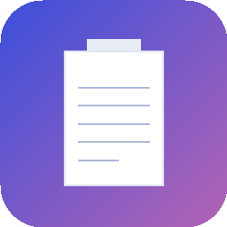

<p align="center">
  
</p>

<h1 align="center">clipass</h1>

<p align="center">A macOS menu bar clipboard manager with intelligent transforms and automation hooks.</p>

clipass lives in your menu bar, monitors the system clipboard, stores text history, and can automatically clean up clipboard content using regex-based rules. It also supports triggering external shell commands when clipboard content matches certain patterns.

## Features

- **Clipboard History** - Stores up to 100 recent text items with one-click re-copy
- **Global Hotkey** - `Cmd+Shift+V` to open the popup (customizable)
- **Search** - Real-time filtering across your clipboard history
- **Pin Items** - Pin important entries to keep them at the top; pinned items are exempt from auto-cleanup and max-items pruning
- **Delete Items** - Right-click any entry to delete it, or use "Clear All" to remove everything
- **Content Type Detection** - Automatically detects URLs, emails, JSON, file paths, hex colors, and numbers for context-appropriate actions
- **Copy As...** - Quick text transforms via right-click: UPPERCASE, lowercase, Trimmed, Base64, URL encode/decode, and Formatted JSON
- **Context Actions** - Define custom shell commands that appear in the right-click menu, with optional regex content filtering and clipboard replacement
- **Transform Rules** - Regex-based rules that automatically clean clipboard content (e.g., strip trailing whitespace, normalize line endings)
- **Automation Hooks** - Execute shell commands when clipboard content matches a pattern, with clipboard content available via `$CLIPASS_CONTENT` and `$CLIPASS_SOURCE_APP` environment variables
- **Ignored Apps** - Exclude specific apps by bundle identifier from clipboard capture
- **Ignore Patterns** - Skip storing clipboard content that matches specific regex patterns
- **Redaction Patterns** - Automatically mask sensitive data (API keys, credit cards, emails, phone numbers) in the clipboard preview
- **Display Formatting** - Configurable preview length (20-200 chars) with word-boundary truncation and invisible character stripping
- **Auto-Cleanup** - Optionally auto-delete items older than 1, 7, 30, or 90 days; pinned items are exempt
- **Launch at Login** - Optional auto-start via macOS Login Items
- **Password Manager Aware** - Ignores transient/concealed pasteboard types from password managers
- **Settings** - Sidebar-style settings with tabs for General, Transforms, Automation, Filtering, Display, and Actions

## Requirements

- macOS 14 (Sonoma) or later
- Swift 5.9+

## Building

clipass uses Swift Package Manager:

```bash
# Clone the repository
git clone https://github.com/noomz/clipass.git
cd clipass

# Build
swift build

# Build for release
swift build -c release
```

The built binary will be at `.build/release/clipass`.

To run directly:

```bash
swift run
```

## Usage

1. Launch clipass - it appears as a clipboard icon in your menu bar
2. Copy text normally - clipass captures it in the background
3. Click the menu bar icon or press `Cmd+Shift+V` to open the popup
4. Click any history item to copy it back to the clipboard
5. Use the search field to filter history

### Transform Rules

Transform rules automatically modify clipboard content using regex patterns. clipass ships with three default rules:

| Rule | Pattern | Effect |
|------|---------|--------|
| Strip Terminal trailing whitespace | `\s+$` | Removes trailing whitespace from Terminal copies |
| Strip trailing whitespace | `\s+$` | Removes trailing whitespace from all apps |
| Normalize line endings | `\r\n` | Converts Windows line endings to Unix |

You can add, edit, disable, or reorder rules in the Settings window. Rules can be scoped to specific source apps by bundle identifier (e.g., `com.apple.Terminal`).

### Automation Hooks

Hooks execute shell commands when clipboard content matches a regex pattern. The clipboard content and source app are passed via environment variables:

- `CLIPASS_CONTENT` - The clipboard text
- `CLIPASS_SOURCE_APP` - Bundle identifier of the source app

Example: Log all clipboard changes to a file:

```bash
echo "$CLIPASS_CONTENT" >> ~/clipboard.log
```

Hooks can also be filtered by source app bundle identifier and are executed asynchronously in the background.

## Architecture

```
clipass/
├── clipassApp.swift              # App entry point, service wiring, auto-cleanup
├── Models/
│   ├── ClipboardItem.swift       # Clipboard history item with pinning (SwiftData)
│   ├── TransformRule.swift       # Regex transform rule (SwiftData)
│   ├── Hook.swift                # Automation hook (SwiftData)
│   ├── ContextAction.swift       # User-defined shell-command context actions (SwiftData)
│   ├── IgnoredApp.swift          # Apps excluded from clipboard capture (SwiftData)
│   ├── IgnoredPattern.swift      # Regex patterns to skip storing content (SwiftData)
│   └── RedactionPattern.swift    # Sensitive data masking patterns (SwiftData)
├── Services/
│   ├── ClipboardMonitor.swift    # Clipboard polling, filtering & event dispatch
│   ├── TransformEngine.swift     # Regex transform pipeline
│   ├── HookEngine.swift          # External command execution
│   ├── ContentAnalyzer.swift     # Content type detection (URL, email, JSON, etc.)
│   ├── ContextActionEngine.swift # Custom action shell command execution
│   └── DisplayFormatter.swift    # Preview formatting: strip, redact, truncate
└── Views/
    ├── ClipboardPopup.swift      # Menu bar popup UI
    ├── HistoryItemRow.swift      # History item row with context menu
    ├── SettingsView.swift        # Sidebar settings container (6 tabs)
    ├── RulesView.swift           # Transform rules list
    ├── RuleEditorView.swift      # Rule editor form
    ├── HooksView.swift           # Hooks list
    ├── HookEditorView.swift      # Hook editor form
    ├── ContextActionsView.swift  # Context actions list
    ├── ContextActionEditorView.swift # Context action editor form
    ├── IgnoredAppsView.swift     # Ignored apps list
    ├── IgnoredAppEditorView.swift    # Ignored app editor form
    ├── IgnoredPatternsView.swift     # Ignored patterns list
    ├── IgnoredPatternEditorView.swift # Ignored pattern editor form
    ├── DisplaySettingsView.swift     # Display & redaction settings
    ├── RedactionPatternsView.swift   # Redaction patterns list
    └── RedactionPatternEditorView.swift # Redaction pattern editor form
```

Built with SwiftUI, SwiftData, [KeyboardShortcuts](https://github.com/sindresorhus/KeyboardShortcuts), and [LaunchAtLogin](https://github.com/sindresorhus/LaunchAtLogin).

## License

[MIT](LICENSE)
